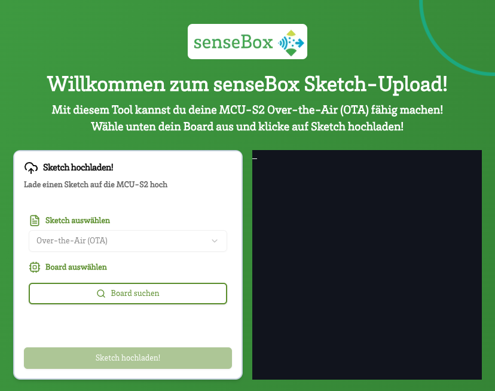

# esptool-sensebox



**esptool-sensebox** is a web-based application that allows you to upload sketches for the MCU-S2 of your senseBox Over-the-Air (OTA). The project uses Next.js, Tailwind CSS, and [esptool-js](https://github.com/themadinventor/esptool-js) in combination with the Web Serial API to establish a direct connection to your board. The terminal output is displayed in real-time using [xterm.js](https://xtermjs.org/).

## Features

- **Serial Connection:**  
   Uses the Web Serial API to connect to your board via the browser (supported browsers: Chrome, Edge, Opera).

- **Real-time Terminal:**  
   Displays the output of the flash process in an embedded terminal (xterm.js).

- **Loading and Success Messages:**  
   Animated loading indicators when establishing the connection and flashing; highlighted notifications for successful connections and error handling.

## Installation

```sh

npm install # install dependency
npm start # run dev server

```

## Live Site

The main branch is deployed on https://flashsensebox.netlify.app/
